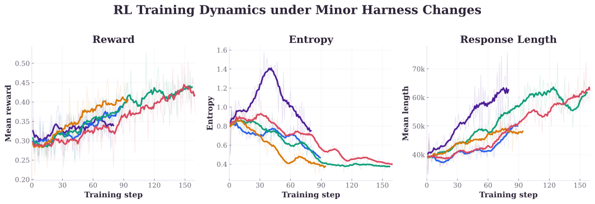
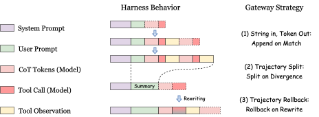
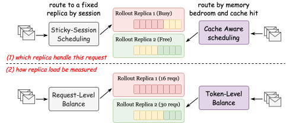
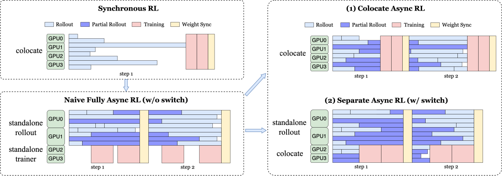
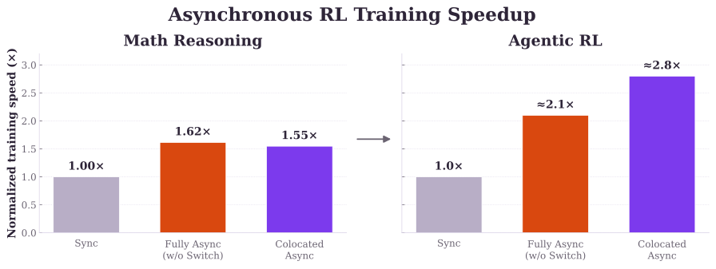
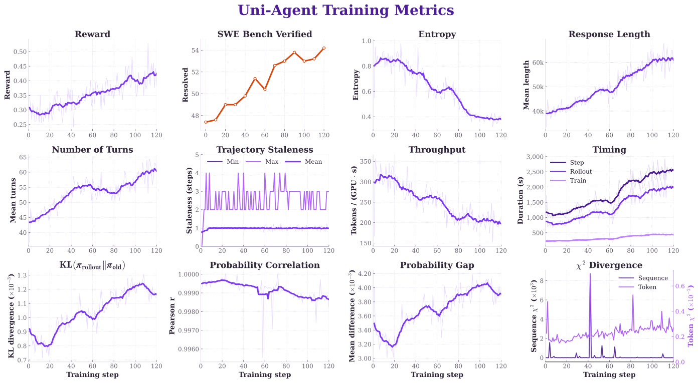
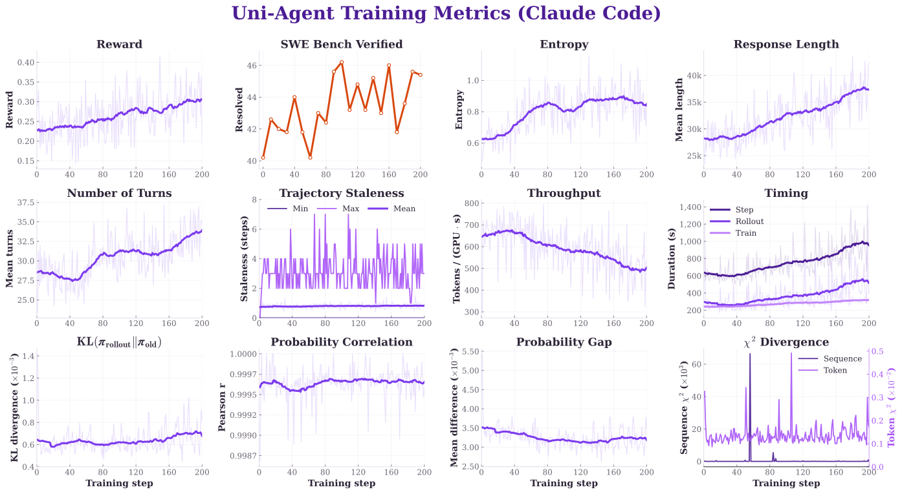
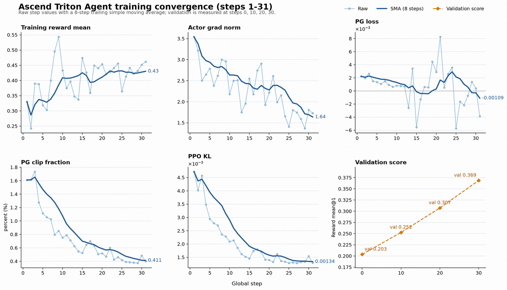

AI agents have advanced rapidly this year, with coding agents such as Claude Code and Codex demonstrating impressive performance. This progress is powered by a new generation of foundation models with strong reasoning and coding abilities, such as Claude Fable 5 and GPT-6 Astra. However, effectively training these models  remains an open challenge for the open-source community.

Motivated by this, we introduce Uni-Agent, an open framework for effectively training long-horizon agents with reinforcement learning. Beyond connecting diverse agent harnesses and tasks to RL pipelines, Uni-Agent provides practical training techniques, recipes, and insights for building agentic RL systems.

In this blog, we share our experience and insights from training long-horizon agents with RL, focusing on three key challenges:

- **Harness Adaptation:** Agentic RL can be sensitive to harness design.
- **RL Training:** What works for single-turn RL may not meet the needs of agentic workloads.
- **Recipes and Experiments:** What practical factors matter for agent RL?

Finally, we conclude by outlining open challenges and our future directions.

## Harness Adaptation

In our research, we identified a clear gap between reasoning agents and agentic RL systems. First, RL training is highly sensitive to harness design, which can substantially affect training outcomes. Second, frequent context switching fragments trajectories and reduces training efficiency.

### RL Effectiveness Is Sensitive to Harness Design

Our experiments reveal two forms of harness sensitivity. First, the same model can behave very differently across harnesses, leading to a model–harness mismatch. Second, even minor implementation changes within a harness can substantially affect RL training dynamics and outcomes.

**Multi-Harness Training.** Model–harness mismatch is particularly pronounced among many earlier open-source models. For newer models, multi-harness training has become increasingly important for improving cross-harness generalization. In Uni-Agent, each training sample can independently specify its prompt, agent harness, task execution pipeline, sandbox backend, and reward function. This sample-level modularity allows different harnesses, execution pipelines, and sandbox backends to be mixed within a single training run.

<figure class="fig">
  
</figure>

**Fine-Grained Harness Customization.** We find that even minor changes to a harness can lead to substantial differences in training dynamics and outcomes. Examples include fixing minor implementation bugs in harness tools and adjusting how the harness handles unexpected model behavior, such as responses without tool calls. To make harness behavior explicit and controllable, Uni-Agent supports both black-box integration of existing harnesses and fine-grained customization through exposed ReAct components, including agent loops, tool sets, and error-handling policies.

<figure class="fig">
  
</figure>

### RL Efficiency Is Sensitive to Context Switching

Agent harnesses manage interactions as sequences of text-based model calls, whereas RL training requires exact token-level trajectories. Bridging the two introduces two challenges:

1. **Token fidelity:** re-tokenizing accumulated context can change the original token sequence, causing training to optimize a sequence not actually sampled during rollout.
2. **Trajectory fragmentation:** treating each call independently avoids this mismatch but creates many separate trajectories and repeatedly processes shared context, increasing rollout and training costs.

The Uni-Agent Gateway addresses both by preserving exact rollout tokens and grouping model calls into coherent trajectories whenever possible. This goes beyond simple prefix matching and append-only chaining, because a harness may compress, branch, or rewrite its conversation history.

<figure class="fig">
  
</figure>

We introduce three mechanisms:

**String In, Token Out.** The Gateway exposes a standard text interface to agent harnesses and sends exact rollout records to the training pipeline. Each record contains the sampled token IDs, masks, and log probabilities. This avoids mismatch introduced by decoding and retokenizing model outputs.

**Trajectory Split.** When an incoming context extends the current chain, the Gateway appends the newly generated tokens to that trajectory. If the context represents a different view, such as after context trimming or branching, it creates a separate chain. This prevents incompatible histories from being merged.

**Trajectory Rollback.** When a harness discards or retries a recent model action, the Gateway rolls back to the corresponding action boundary and removes the abandoned tokens. Replacement content is treated as context rather than trainable output, ensuring that discarded actions do not enter the training signal.

Together, these mechanisms decouple agent harnesses from the RL pipeline, allowing diverse harnesses to integrate seamlessly while preserving exact rollout tokens and efficiently handling complex context changes.

## RL Training

RL pipelines center on two major stages: rollout generation and policy optimization. Moving from short, single-turn tasks to long-horizon agent tasks such as coding produces much longer trajectories, introducing two major systems challenges:

- **Long-context Rollout:** With ultra-long contexts, rollout can account for 60%-80% of the time per training step, becoming a major bottleneck.
- **Rollout-Trainer Imbalance:** As training progresses, the workload between standalone rollout and training gradually becomes imbalanced, leaving part of the GPU resources idle.

### Agentic Rollout Optimization

Unlike single-turn workloads, agentic rollout involves repeated model inference and environment interaction. This creates two scheduling problems: (1) cached prefixes can be repeatedly evicted between turns, causing redundant prefills; and (2) session counts do not reflect actual load because context lengths and cache states vary widely. Uni-Agent addresses them with agent cache-aware scheduling and token-level load balancing.

<figure class="fig">
  
</figure>

**Cache-Aware Scheduling.** During multi-turn rollout, requests from other sessions can evict a paused session's cached prefix. Re-prefilling that session may then evict other prefixes, creating cache thrashing under high load. Sticky-session scheduling in verl routes all calls from the same session to a fixed inference replica, but it can be difficult to adapt to cache eviction and changing memory pressure. Uni-Agent enhances this by continuously tracking prefix cache residency and available GPU memory. It prioritizes an instance containing a reusable prefix when sufficient memory is available, and relaxes the fixed binding when memory falls below a threshold. This preserves prefix reuse while reducing repeated prefills and local overload.

**Token-Level Load Balancing.** Agent rollout requests vary widely in context length. A single long-context request can place more load on an inference instance than several short requests, making request count an imprecise load metric. verl uses request count as a lightweight estimate of load. Uni-Agent enhances this estimate with token-level information, including how much context must be processed, whether a reusable prefix is cached, and how much KV cache remains on each instance. It then routes requests based on their actual workload, reducing stragglers and GPU idle time.

### Asynchronous RL Training

RL systems have moved from synchronous execution toward fully asynchronous pipelines, allowing rollout generation and policy optimization to overlap. In agentic RL, however, their relative workloads change over time. As rollout trajectories grow longer, a fixed GPU allocation can become increasingly misaligned with the workload, causing pipeline stalls and leaving resources underutilized.

To address this dynamic imbalance, Uni-Agent provides two execution modes: (1) Colocated Async keeps rollout workers and trainers in a shared resource pool and supports partial rollouts, allowing a trajectory to continue across policy updates. (2) Separate Async builds on the fully asynchronous design with separate resource pools but adds role switching. When trainer GPUs would otherwise be idle, they can temporarily serve as rollout workers and contribute additional inference capacity. Together, these modes adapt resource usage to changing rollout and training workloads.

<figure class="fig">
  
</figure>

On the reasoning tasks, compared with sync training, Colocated Async reduces the wall-clock time of a 150-step training run by 35.4%, while Separate Async achieves a 38.1% reduction. On agentic RL workloads, Uni-Agent achieves around 40% higher throughput than the fully asynchronous baseline and more than twice the throughput of synchronous training.

<figure class="fig">
  
</figure>

## Recipes and Experiments

Finally, we turn to the environments in which agents learn. Here, we use environment broadly to include the task distribution, execution context, and verifier that produces rewards. Across our coding-agent training runs, two aspects consistently stood out: task quality and reward reliability.

### Training Data

Effective agentic RL requires tasks that are both valid and matched to the model's current capabilities. Even carefully constructed datasets can contain specification defects. Problem statements may conflict with reference solutions or tests, required interfaces may be omitted, objectives may be ambiguous, and hidden tests may enforce unstated requirements. Such defects can cause an agent to fail for reasons unrelated to its capabilities, producing misleading training signals.

Even valid tasks may provide little learning signal if they are too easy or too difficult. We first use offline Best-of-N rollouts to estimate task difficulty and construct an initial training set. Because the model evolves during training, we aggregate historical trial results to update these estimates and identify tasks associated with capability growth. Dynamic sampling then excludes tasks with recent pass rates of 0 or 1, focusing training on tasks that remain challenging but learnable.

### Verification and Reward Modeling

Verification determines which behaviors RL reinforces. As models become more capable, they also become better at discovering unintended shortcuts. For example, a coding agent may locate the upstream GitHub repository and inspect its commit history to recover the reference solution. A verifier based only on test results may assign full reward to this behavior, reinforcing solution leakage rather than genuine problem solving.

Simply disabling network access is not a reliable solution. Coding agents often require network access to install dependencies, while some problem statements link to historical issues that provide essential context. Blocking access can therefore break valid workflows and introduce failures unrelated to model capability. Reward design must balance leakage prevention with the external access required to solve the task.

Effective agentic RL ultimately depends on environments that are well specified, appropriately challenging, and reliably verifiable, while still providing the context and tools required for legitimate solutions.

### Selected Experiments

We list three representative experiments as below:

**Training Qwen3-Coder-30B on SWE Tasks + Customized React Agent**

**Training script:** https://uni-agent.readthedocs.io/en/stable/quickstart/rl-training.html#case-1-react-agent-rl

<figure class="fig">
  
</figure>

**Training Qwen3-Coder-30B on SWE Tasks + Customized React Agent**

**Training script:** https://uni-agent.readthedocs.io/en/stable/quickstart/rl-training.html#case-2-claude-code-rl

<figure class="fig">
  
</figure>

**Training Qwen3.6-35B on Kernel Agent Tasks + Claude Code Harness**

**Training script:** https://github.com/verl-project/uni-agent/tree/main/examples/claude_code_kernel_task

<figure class="fig">
  
</figure>

## Future Work

We believe agentic RL is not merely about eliciting knowledge already acquired through mid-training and SFT. Instead, it has the potential to enable models to reach a new level of capability. There is still a long way to go, and Uni-Agent will continue to evolve in three directions:

1. **Broader ecosystem support.** We will expand Uni-Agent to support more modalities, a wider range of tasks, increasingly sophisticated agent harnesses, and a broader set of sandbox backends.
2. **End-to-end system optimization.** We will continue improving the efficiency of rollout generation, policy training, and their coordination.
3. **Deeper training research.** We will further investigate RL algorithms, training data, reward modeling, and practical recipes that drive robust and generalizable capability gains.

Throughout this process, we will continue sharing our latest progress through technical insights and reproducible experiments. We invite researchers and developers from the LLM and agent communities to try Uni-Agent, share feedback, and contribute to its development. Together, we hope to advance agentic RL as an open and collaborative research direction.
